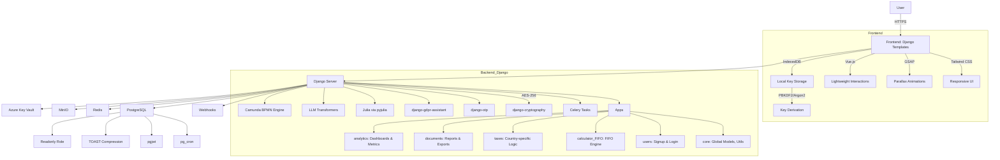

# Eisphora

> 🧾 **Eisphora** is an open-source, secure-by-design crypto tax app — built in Django with no exposed REST API.  
> 🧠 Local key derivation (Argon2/PBKDF2), AES-256 encryption, FIFO-based reporting, Julia-powered calculations.  
> 🔐 Frontend uses Django Templates + Tailwind + GSAP/Vue.js — minimal JS, no attack surface.  
> 🇫🇷🇺🇸🇱🇺 Focused on privacy, legal clarity, and multilingual support.  
> ⚠️ Built by one developer, security first. Next.js/React-ready for future versions.

**Eisphora** is an open-source web application designed to simplify crypto-related tax management. Initially focused on the French tax system, it aims to support the US, Luxembourg, and other jurisdictions. Developed by a solo developer, the project emphasizes **security**, **clarity**, and **long-term maintainability**.

> ✦ Multilingual, auditable, and privacy-first.  
> ✦ Built without exposing a REST API or relying on external frontend runtimes like Next.js.

---

## 🔒 Why This Architecture?

The project originally used a React/Next.js frontend connected to Django via REST APIs. This introduced:

- A broader attack surface (CORS, CSRF, token leakage risks),
- An overcomplicated setup for a local or low-userbase deployment,
- An unnecessary architectural split for a secure, single-user tool.

Instead, Eisphora now uses **Django Templates** for rendering, along with modern frontend libraries (Tailwind, GSAP, Vue.js) directly embedded into the server-rendered flow. Data encryption and key management are **performed locally** in the browser using `IndexedDB` and `PBKDF2/Argon2`.

> Nothing prevents future reintegration of a modern frontend stack (like Next.js), but only once the app is secure and stable enough to justify it.

---

## ✨ Features

- Tax reporting based on FIFO method and income brackets
- Advanced transaction management
- Multilingual UI (English, French, Spanish)
- AES-256 secure data encryption (local + server)
- Heavy computation offloading using Julia
- Transformer-based LLM for tax interpretation
- Declarative BPMN workflows with Camunda
- Document and reporting generation
- GDPR-friendly by design

---

## 🧠 Architecture Overview

Here is the updated architecture diagram reflecting the current stack:



##  🚀 Installation Guide

### 1. Clone the Repository

```git clone https://github.com/OrionUnix/Eisphora.git
cd Eisphora
```

#### 2. Configure Environment Variables

**Backend**
Copy or create a .env file at the project root:

```bash
cp .env.example .env
# Edit it with your DB credentials, secret keys, etc.
```

**_Frontend (Optional)  _**
Only if you reintroduce the frontend build process (Vue/Next.js/etc.):

```touch frontend/.env.local
# Example:
NEXT_PUBLIC_BASE_URL=http://localhost:8000

```

### Install Backend Dependencies

```cd backend
python -m venv venv
source venv/bin/activate
pip install -r requirements.txt

```

### 4. (Optional) Install Frontend Dependencies

Only if you re-enable JS assets:

```cd ../frontend
npm install```

### 5. Apply Database Migrations

```cd ../backend
python manage.py migrate

```

### 6. Build Frontend Assets (Optional)

```./build_frontend.sh
# or manually: cd frontend && npm run build
```

### 7. Run the Server

``` cd backend
python manage.py runserver
```

## 🤝 Contributing

See [CONTRIBUTING.md](CONTRIBUTING.md) for details on how to contribute to the project.

## 📄 License

This project is licensed under the [BSD-3-Clause License](LICENSE) - see the [LICENSE](LICENSE) file for details.

## 🧭 Roadmap

 * Expand tax logic to US, Luxembourg, Germany
 * Improve local encryption UX (password entropy hints, key backup)
 * Add PDF export of tax reports
 * Consider reintroducing REST API + external frontend (as an opt-in)
