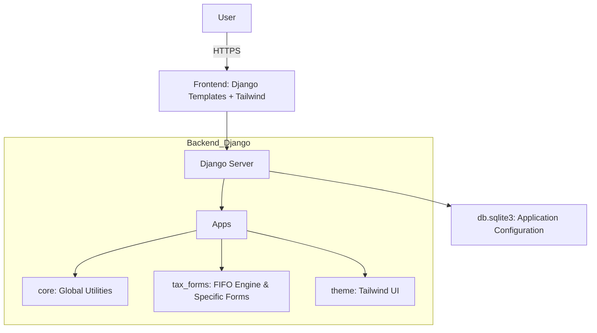

# Eisphora

> 🧾 **Eisphora** is an open-source, secure-by-design crypto tax app — built in Django.  
> 🔐 A simple, completely stateless tool that processes CSV files in-memory to calculate your taxes.  
> 🇫🇷🇺🇸🇱🇺 Focused on privacy, legal clarity, and multilingual support.  
> ⚠️ Built by one developer, security first.

**Eisphora** is an open-source web application designed to simplify crypto-related tax management. Initially focused on the French tax system, it aims to support the US, Luxembourg, and other jurisdictions. Developed by a solo developer, the project emphasizes **security**, **clarity**, and **long-term maintainability**.

> ✦ Multilingual, auditable, and privacy-first.  
> ✦ Built without exposing a REST API or relying on external frontend runtimes like Next.js.

---
 link : https://orionj.pythonanywhere.com/fr-fr/


## 🔒 The "Stateless" Security Model

Most tax applications store your financial history in databases, creating massive honeypots for hackers. 

**Eisphora takes a different approach:**
1. **In-Memory Processing:** Uploaded CSV files (like exchange exports) are handled strictly in RAM via Django's file handlers.
2. **Zero-Disk Policy:** Once the FIFO calculations are done and the HTML results are rendered to your screen, the memory is wiped. No transaction data is stored in the database.
3. **No User Accounts Needed:** By not forcing users to create accounts, we eliminate the risks of token leakage, password breaches, or identity theft.

---
## 🔒 Why This Architecture?

Eisphora explicitly moved away from a decoupled **Next.js/React** frontend. A decoupled architecture would have required exposing a **REST API**, which significantly increases the attack surface (CORS, token leakage, endpoint security).

By using **Django Templates**, we keep the entire logic and rendering server-side, adhering to a "security-by-design" philosophy. This approach eliminates the risks associated with client-side state management and external API communications.

Because no sensitive user data is persisted on disk in the default configuration, there is no need for complex encryption at rest or user authentication systems for basic usage.

---

## 🏗️ Usage Modes

### Privacy Mode (Default)
- **No Account Required**: Immediate use without any registration.
- **In-Memory Processing**: Data is handled strictly in RAM via Django's `MemoryFileUploadHandler`.
- **Zero Persistence**: No transaction data is stored on disk or in the database.

### SaaS Mode (For Forkers)
- **User Accounts**: The architecture allows for enabling accounts and persistent storage.
- **Advanced Persistence**: Support for **PostgreSQL** and **AES-256 encryption** via `django-cryptography`.
- **Commercial Foundation**: Provides a robust base to build paid services or commercial tax platforms (similar to Waltio).
- **Business-Friendly License**: Licensed under **BSD-3-Clause**, allowing companies to integrate and extend the codebase into proprietary products with minimal restrictions (unlike GPL).
- ⚠️ **Note**: `django-cryptography` is available in the stack but is intentionally disabled in development mode to simplify the setup.

---

---

## ✨ Features

- Tax reporting based on FIFO method
- Advanced transaction analysis
- Multilingual UI (English, French, Spanish)
- Stateless in-memory calculation (no data stored)
- PDF generation for tax forms

---

## 🧠 Architecture Overview

Here is the architecture diagram reflecting the current stack:


```mermaid
graph TD
    A[User] -->|HTTPS| B[Frontend: Django Templates + Tailwind]
    B --> H[Django Server]
    subgraph Backend_Django
        H --> I[Apps]
        I --> J[core: Global Utilities]
        I --> K[tax_forms: FIFO Engine & Specific Forms]
        I --> L[theme: Tailwind UI]
    end
    H --> M[db.sqlite3: Application Configuration]
```

## 🚀 Installation Guide

### 1. Clone the Repository

```bash
git clone https://github.com/OrionUnix/Eisphora.git
cd Eisphora
```

### 2. Configure Environment Variables

Copy or create a `.env` file at the project root:

```bash
cp .envExample .env
# Edit it with your Django secret key, etc.
```

### 3. Install Backend Dependencies

```bash
python -m venv venv
# On Linux/macOS:
source venv/bin/activate
# On Windows:
# venv\Scripts\activate

cd backend
pip install -r requirements.txt
```

### 4. Apply Database Migrations

```bash
python manage.py migrate
```

### 5. Run the Server

**On Linux / macOS:**
You can run the server using the provided script from the root folder:
```bash
./runserver.sh
```
Or manually:
```bash
python manage.py runserver
```

**On Windows:**
You can use the provided batch script from the root folder:
```cmd
runserver.bat
```
Or manually:
```cmd
python manage.py runserver
```

## 🤝 Contributing

Contributions are welcome. Please ensure that all code comments, variable names, and application structures remain in **English** to maintain consistency, even though the end-user UI is multilingual (FR/EN/ES).

## 📄 License

This project is licensed under the [BSD-3-Clause License](LICENSE) - see the [LICENSE](LICENSE) file for details.

## 🧭 Roadmap

### ✅ Done
- FIFO calculation engine (validated)
- French tax form 2086 helper
- Portfolio visualization
- CSV & PDF export
- Multilingual UI (FR/EN/ES)
- Legal disclaimer system

### 🚧 In Progress
- SaaS mode (user accounts + PostgreSQL)
- AES-256 encryption activation (django-cryptography)

### 🔜 Next
- Multi-exchange CSV support (Binance, Kraken, Ledger)
- US & Luxembourg tax logic
- Stripe integration scaffold (for forkers)

### 💡 Considered
- Staking / DeFi / NFT fiscal edge cases
- Automated exchange API imports
- REST API opt-in for decoupled frontends
